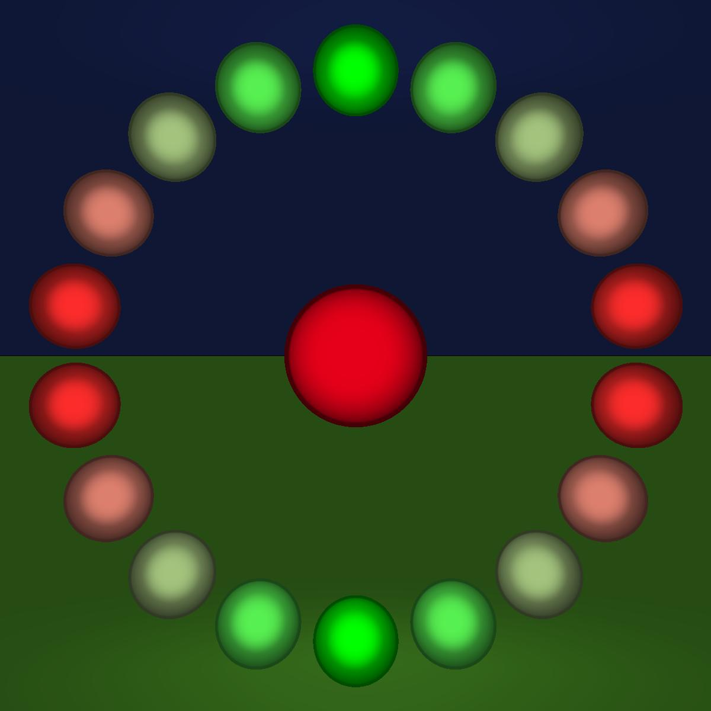

# Ray Tracing in CUDA C++

## Some results

### Directional light

### Point light

### Spot light

### Changing resolution

### Rotating camera

### Screen Distance

### Screen Size

### Sharp and soft diffuse/specular

### Border 

### Some other outputs

